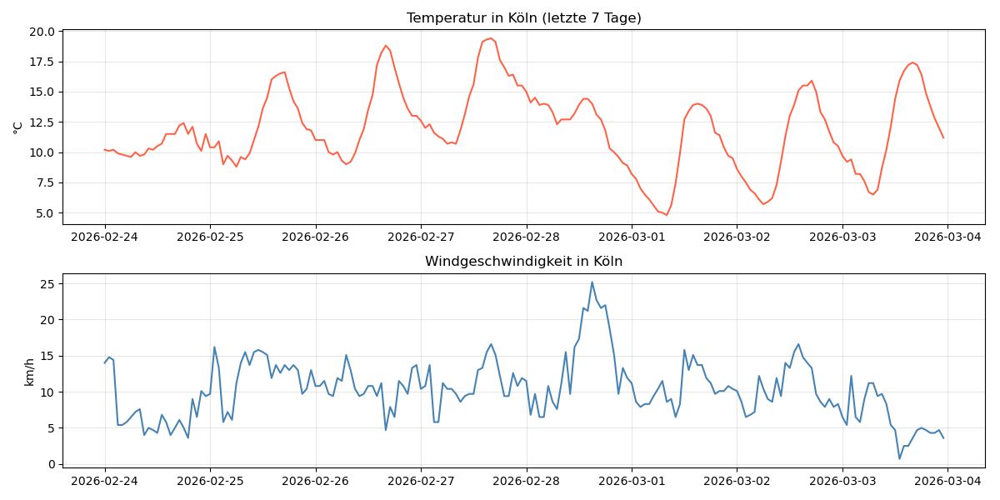

# weather-etl-koeln
ETL pipeline: weather data for Köln using Open-Meteo API
# 🌤️ Weather ETL Pipeline – Köln

ETL pipeline that automatically fetches, cleans and stores 
hourly weather data for Köln using the Open-Meteo API.

## 📌 What this project does
- **Extract** – fetches hourly weather data from Open-Meteo API (no API key needed)
- **Transform** – cleans data, checks for missing values, adds time features
- **Load** – stores data in a local SQLite database

## 🛠️ Technologies
- Python, Pandas, SQLAlchemy, Matplotlib
- Open-Meteo API
- SQLite

## 📊 Output

## ▶️ How to run
1. Clone this repository
2. Open `w
